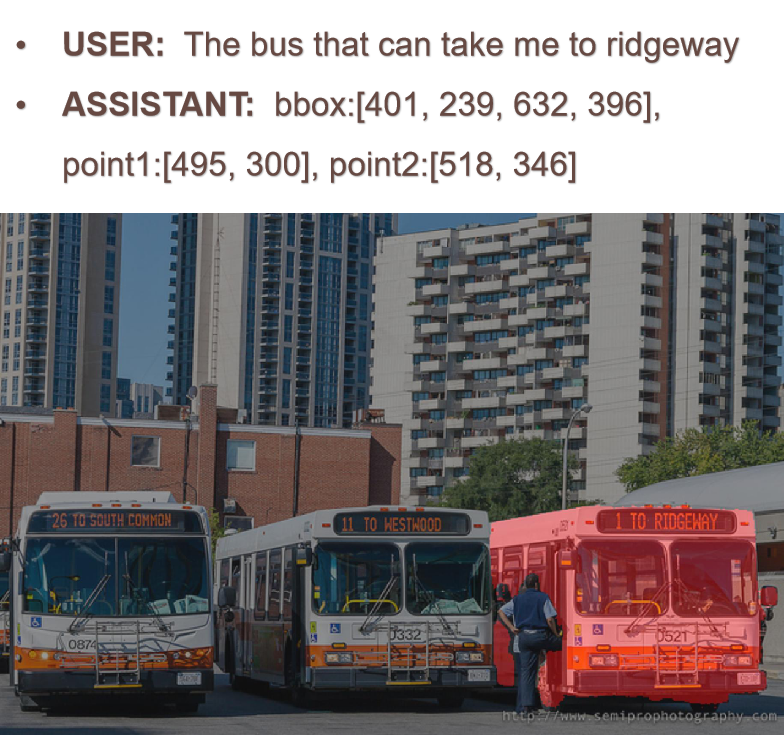
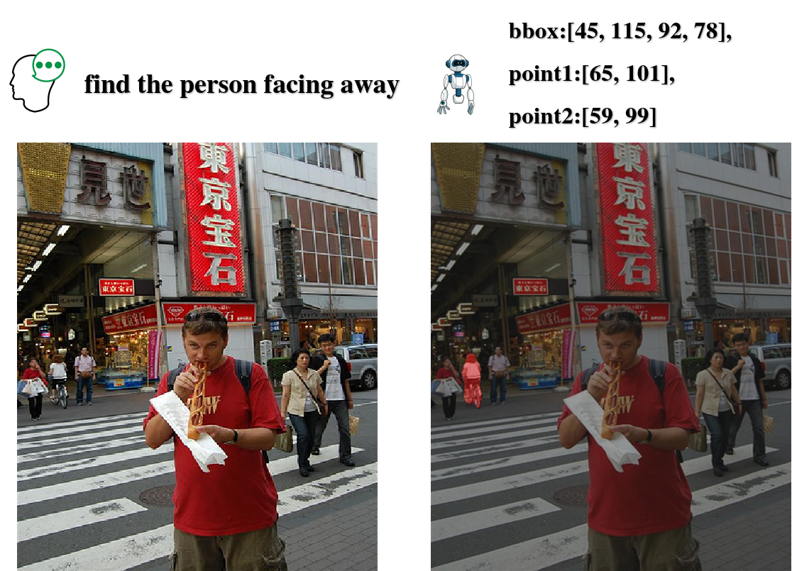
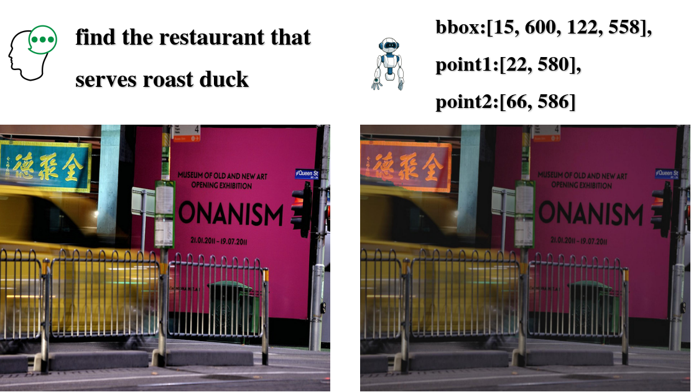

# SEG-GRPO
- Authors: [Guoku Jia], [Yuan Liang], [YiShi Chen], [YanMei Meng], [XiangNing Wu]
- Institutes: The University of Guangxi
  
We employ GRPO algorithm to train qwen-VL for Referring image segmentation. We expect that this project can be helpful to human AI interaction and robotics.
## Result




## Installation

we use torch==2.5.1 and transformers==4.49.0, other packages can be found in scripts.


## Data preparation
Referring segmentation datasets: [refCOCO](https://web.archive.org/web/20220413011718/https://bvisionweb1.cs.unc.edu/licheng/referit/data/refcoco.zip), [refCOCO+](https://web.archive.org/web/20220413011656/https://bvisionweb1.cs.unc.edu/licheng/referit/data/refcoco+.zip), [refCOCOg](https://web.archive.org/web/20220413012904/https://bvisionweb1.cs.unc.edu/licheng/referit/data/refcocog.zip), [refCLEF](https://web.archive.org/web/20220413011817/https://bvisionweb1.cs.unc.edu/licheng/referit/data/refclef.zip) ([saiapr_tc-12](https://web.archive.org/web/20220515000000/http://bvisionweb1.cs.unc.edu/licheng/referit/data/images/saiapr_tc-12.zip)) and [COCO2014train](http://images.cocodataset.org/zips/train2014.zip)  
```
├── dataset
│   ├── refer_seg
│   │   ├── images
│   │   |   └── mscoco
│   │   |       └── images
│   │   |           └── train2014
│   │   ├── refclef
│   │   ├── refcoco
│   │   ├── refcoco+
│   │   └── refcocog
```
## Weights
Qwen2.5-VL and Sam2 are required, which can be automatically downloaded through the transformers library or downloaded locally from the Huggface website.
The trained Lora weight model can be downloaded from here. (https://huggingface.co/guoku/SEG-GRPO).
If you encounter network problems, you can try using the mirror website. (https://hf-mirror.com/guoku/SEG-GRPO)


## Getting Started
Please try it via inference.py
